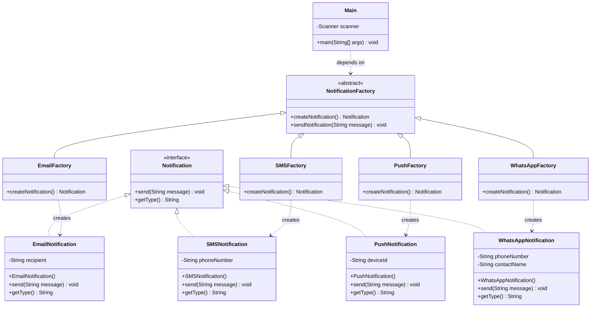

# Padrao Factory Method e SOLID - TSI 5o Periodo IF Goiano

## Objetivo da Aula
Implementar um sistema flexivel de notificacoes utilizando o padrao Factory Method, demonstrando na pratica os principios do SOLID, especialmente o Open/Closed Principle (OCP).

## 1. Problema Apresentado
A empresa precisa enviar notificacoes por multiplos canais:

- E-mail
- SMS
- Push Notification

Requisitos principais:

- Flexibilidade para adicionar novos canais
- Evitar modificacoes no codigo existente ao adicionar novos canais

## 2. Solucao Proposta
Implementacao do padrao Factory Method com a seguinte estrutura:

### 2.1 Produto Abstrato (`Notification`)
Interface que define o contrato para todas as notificacoes.

Metodos:

- `send(message)`
- `getType()`

### 2.2 Produtos Concretos

- `EmailNotification`
- `SMSNotification`
- `PushNotification`
- `WhatsAppNotification` (adicionado posteriormente)

### 2.3 Criador Abstrato (`NotificationFactory`)
Classe abstrata com o Factory Method `createNotification()`.

Tambem possui o metodo concreto `sendNotification()`, que utiliza o factory method.

### 2.4 Criadores Concretos

- `EmailFactory`
- `SMSFactory`
- `PushFactory`
- `WhatsAppFactory` (adicionado sem modificar as classes existentes)

### 2.5 Cliente (`Main`)

- Gerencia a interface com o usuario
- Seleciona a fabrica adequada com base na escolha
- Envia notificacoes

## 3. Principios SOLID Demonstrados

| Principio | Como foi aplicado |
| --- | --- |
| Single Responsibility | Cada classe tem uma unica responsabilidade: notificacoes apenas enviam mensagens, fabricas apenas criam objetos e `Main` apenas gerencia a interface. |
| Open/Closed | Sistema aberto para extensao e fechado para modificacao. O canal WhatsApp foi adicionado sem alterar classes existentes. |
| Liskov Substitution | Todas as fabricas concretas podem substituir a fabrica abstrata, assim como todas as notificacoes podem substituir a interface `Notification`. |
| Interface Segregation | A interface `Notification` e especifica e coesa, com apenas os metodos necessarios: `send()` e `getType()`. |
| Dependency Inversion | `Main` depende da abstracao `NotificationFactory`, e nao das fabricas concretas. |

## 4. Demonstracao do Open/Closed Principle

O que nao foi modificado (fechado para alteracao):

- `Notification.java`
- `EmailNotification.java`
- `SMSNotification.java`
- `PushNotification.java`
- `NotificationFactory.java`
- `EmailFactory.java`
- `SMSFactory.java`
- `PushFactory.java`

O que foi adicionado (aberto para extensao):

- `WhatsAppNotification.java`
- `WhatsAppFactory.java`

Unica modificacao necessaria:

- `Main.java` (apenas para incluir a opcao 4 no menu da interface)

## 5. Beneficios do Padrao Factory Method

| Beneficio | Explicacao |
| --- | --- |
| Desacoplamento | O cliente nao conhece as classes concretas de notificacao. |
| Extensibilidade | Novos canais podem ser adicionados sem impacto no codigo existente. |
| Manutenibilidade | Codigo organizado por responsabilidades. |
| Testabilidade | Facil criar mocks e testes unitarios. |
| Reusabilidade | Fabricas podem ser reutilizadas em diferentes contextos. |

## 6. Estrutura Final do Projeto

```text
notificacoes/
├── Notification.java          (interface - NAO MODIFICADA)
├── EmailNotification.java     (NAO MODIFICADO)
├── SMSNotification.java       (NAO MODIFICADO)
├── PushNotification.java      (NAO MODIFICADO)
├── WhatsAppNotification.java  (NOVO - ADICIONADO)
├── NotificationFactory.java   (abstrata - NAO MODIFICADA)
├── EmailFactory.java          (NAO MODIFICADO)
├── SMSFactory.java            (NAO MODIFICADO)
├── PushFactory.java           (NAO MODIFICADO)
├── WhatsAppFactory.java       (NOVO - ADICIONADO)
└── Main.java                  (MODIFICADO - apenas menu)
```

## 7. Aprendizados Praticos

- Factory Method: delega a criacao de objetos para subclasses.
- OCP: permite estender sistemas sem modificar codigo existente.
- Baixo acoplamento: depender de abstracoes, nao de implementacoes.
- Coesao: cada classe possui uma responsabilidade unica.
- Arquitetura flexivel: sistemas preparados para mudancas futuras.

## 8. UML - Visao Geral da Arquitetura



## 9. Conclusoes Finais

- Factory Method e ideal para sistemas que precisam ser extensiveis.
- OCP permite adicionar novas funcionalidades sem risco de quebrar codigo existente.
- O padrao promove baixo acoplamento e alta coesao.
- O codigo se torna mais limpo, testavel e manutenivel.
- A adicao do WhatsApp demonstrou, na pratica, como o sistema pode evoluir sem modificacoes nas classes ja existentes.

## Observacao
No GitHub ja estao presentes tanto a primeira quanto a segunda versao desse codigo.
